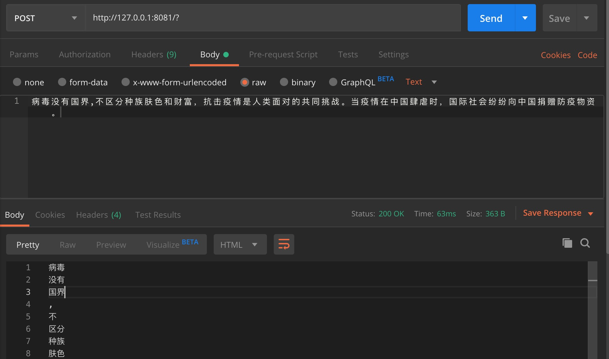

A simple http service for Jieba Chinese segmentation tool
===

The http server uses functions-framework, an awesome FaaS framework.

You can build this docker image by running 
```
docker build -t jieba-http-service-docker:1.0 .
```

After building this image, you can run this service by running
```
docker run -d -p 8081:8080 jieba-http-service-docker:1.0
```

You can test the API on the command line
```
echo '病毒没有国界,不区分种族肤色和财富，抗击疫情是人类面对的共同挑战。当疫情在中国肆虐时，国际社会纷纷向中国捐赠防疫物资。' |  \
  http POST http://127.0.0.1:8081/
```
or a postman console


